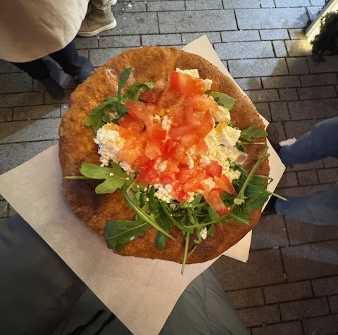

# Langos Tarifi (Almanya Mutfaklarından)

## **Malzemeler:**

- 1 su bardağı ılık su 💧
- 1 paket kuru maya 🧑‍🍳
- 1 yemek kaşığı şeker 🍯
- 1 çay bardağı sıvı yağ 🛢️
- 1 tatlı kaşığı tuz 🧂
- 4 su bardağı un 🌾
- 1 su bardağı süt 🥛
- 1 adet yumurta 🥚
- Kızartmak için sıvı yağ 🛢️

  
## **Yapılışı:**

1. Ilık suya şeker ve kuru mayayı ekleyip karıştırın ve mayanın aktif hale gelmesi için 5 dakika bekleyin ⏳.

2. Geniş bir kaba un, tuz, süt ve yumurtayı ekleyin 🥣. Karışıma maya karışımını ekleyin ve yoğurmaya başlayın 👐.

3. Hamur pürüzsüz hale gelene kadar yoğurun. Üzerini nemli bir bezle örterek 1 saat boyunca mayalanmaya bırakın ⏲️.

4. Hamur mayalandıktan sonra, hamurdan ceviz büyüklüğünde parçalar koparıp yuvarlayın ve ellerinizle açın ✋.

5. Derin bir tavada bolca sıvı yağ ısıtın 🔥 ve hamurları altın rengi olana kadar kızartın 🍳.

6. Lángosları sıcak servis edin, üzerine sarımsaklı yoğurt 🧄🥣, rendelenmiş peynir 🧀 veya tatlı versiyonunda pudra şekeri 🍩 serpebilirsiniz.

Afiyet Olsun 😋🍴

